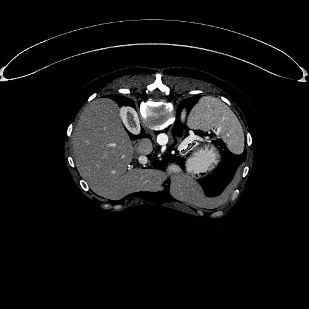
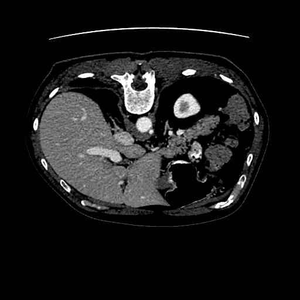

<h2>Pancreas-ImageMask-Dataset (Updated: 2024/02/10)</h2>
This is a Pancreas ImageMask dataset for Image Segmentation.   
The dataset used here has been taken from the following <b>kaggle.com</b> website: 
<a href="https://www.kaggle.com/datasets/salihayesilyurt/pancreas-ct">Pancreas-CT</a>
  

<li>2024/02/09: Modified <a href="./generator/ImageMaskDatasetGenerator.py">ImageMaskDatasetGenerator.py</a> to create the mirrored images and masks.</li> 
<li>2024/02/10: Added <a href="./YOLOAnnotationGenerator.py">YOLOAnnotationGenerator.py</a> 
to create YOLOAnnotation.</li> 

<h3>1. Dataset Citation</h3>

<b>About Dataset</b> 
Summary: 
<pre>
The National Institutes of Health Clinical Center performed 82 abdominal contrast enhanced 3D CT 
scans (~70 seconds after intravenous contrast injection in portal-venous) from 53 male and 27 
female subjects. Seventeen of the subjects are healthy kidney donors scanned prior to nephrectomy. 
The remaining 65 PANCREAS_s were selected by a radiologist from PANCREAS_s who neither had major 
abdominal pathologies nor pancreatic cancer lesions. Subjects' ages range from 18 to 76 years with 
a mean age of 46.8 ± 16.7. The CT scans have resolutions of 512x512 pixels with varying pixel sizes 
and slice thickness between 1.5 − 2.5 mm, acquired on Philips and Siemens MDCT scanners 
(120 kVp tube voltage).

A medical student manually performed slice-by-slice segmentations of the pancreas as ground-truth 
and these were verified/modified by an experienced radiologist.
</pre>
Reference: https://wiki.cancerimagingarchive.net/display/Public/Pancreas-CT 

<a href="./generator/LICENSE">LICENSE</a>

 

<h3>
2. Download master dataset
</h3>
  Please download the original <b>Pancreas-CT</b> dataset from the following <b>kaggle.com</b> website. 

<a href="https://www.kaggle.com/datasets/salihayesilyurt/pancreas-ct">Pancreas-CT</a>
Created by Sean Berryman, last modified by Tracy Nolan on Sep 16, 2020 
 

The dataset <b>Pancreas-CT</b> has the following folder structure. 
<pre>
./Pancreas-CT
│  ├─PANCREAS_0001
│  ├─PANCREAS_0002
│  ├─PANCREAS_0003
│  ├─PANCREAS_0004
│  ├─PANCREAS_0005
│  ├─PANCREAS_0006
│  ├─PANCREAS_0007
│  ├─PANCREAS_0008
│  ├─PANCREAS_0009
│  ├─PANCREAS_0010
...
│  ├─PANCREAS_0062
│  └─PANCREAS_0063
└─TCIA_pancreas_labels-02-05-2017

    
</pre>
Each <b>sub-sub-folder of PANCREAS_*</b> folder contains <b>.dcm</b> files.
<pre>
./PANCREAS_0001
│  └─11-24-2015-PANCREAS0001-Pancreas-18957
│      └─Pancreas-99667
│           ├─1-001.dcm
│           ├─1-002.dcm
│           ...
│           └─1-240.dcm
</pre>
<b>TCIA_pancreas_labels-02-05-2017</b> folder contains <b>.nii</b> files, which contain masks corresponding to pixel-images in the .dcm files.
<pre>
./TCIA_pancreas_labels-02-05-2017
 ├─label0001.nii
 ├─label0002.nii
...
 ├─label0082.nii
</pre>

<h3>
3. Create ImageMask Dataset
</h3>
<h3>
3.1 Create ImageMask-master dataset
</h3>
Please move to <b>generator</b> directory, and run the following command. 
<pre>
>python ./ImageMaskDatasetGenerator.py
</pre>

By using this Python script <a href="./generator/ImageMaskDatasetGenerator.py">ImageMaskDatasetGenerator.py</a>,
 we have created <b>Pancreas-master</b> jpg image dataset of image-size 512x512 from the 
 .dcm files in <b>./PANCREAS_CT/</b> folders and .nii files in <b>TCIA_pancreas_labels-02-05-2017</b>. 

<pre>
./Pancreas-master
├─images
└─masks
</pre>

<h3>
3.2 Split master to test, train and valid 
</h3>
Please run the following command. 
<pre>
python split_master.py
</pre>
, by which we have finally created <b>Pancreas</b> dataset from the Pancreas-master. 
<pre>
../Pancreas-ImageMask-Dataset
├─test
│  ├─images
│  └─masks
├─train
│  ├─images
│  └─masks
└─valid
    ├─images
    └─masks
</pre>
<b>train/images samples:</b> 

 
<b>train/masks samples:</b> 

 
Pancreas-ImageMask-Dataset Statistics: 
 

<h3>3.3 Inspect mask regions </h3>
Please run the following command to inspect mask regions corresponding to images
in <b>./Pancreas-ImageMask-Dataset/train</b> folder. 
<pre>
python ImageMaskBlender.py
</pre> 
, by which <b>Blended_train_dataset</b> can be created, 
Blended_train_dataset samples: 
 
 
Enlarged images: 
<table>
<thead>
<tr>
<td>
images
</td>
<td>
masks
</td>
<td>
blended
</td>
</tr>
</thead>
<tbody>
<tr>
<td></td>
<td></td>
<td></td>
</tr>

<tr>
<td></td>
<td></td>
<td></td>
</tr>

<tr>
<td></td>
<td></td>
<td></td>
</tr>

<tr>
<td></td>
<td></td>
<td></td>
</tr>

<tr>
<td></td>
<td></td>
<td></td>
</tr>
</tbody>
</table>
 
<h3>
4. Download Pancreas-ImageMask-Dataset
</h3>

You can download the augmented V2 dataset including mirrored images and masks: 

<a href="https://drive.google.com/file/d/14DFkGFjm02vORDjvC1q8v0p--E3Ngg9L/view?usp=sharing">
Pancreas-ImageMask-Dataset_V2.0.zip</a>  
, and also the previous V1 dataset: 
<a href="https://drive.google.com/file/d/1Q7cDMSQgtXgZJjg-xIiFHmXOyNn3vio1/view?usp=sharing">Pancreas-ImageMask-Dataset_V1.0.zip</a>

 
 
<h3>
5 EfficientDet-Dataset for Object Detection
</h3>
<h3>
5.1 Create YOLOAnnotation
</h3>
Please run the following command to create YOLOAnntation: 
<pre>
python YOLOAnnotationGenerator.py
</pre>
YOLO train annotation sample: 
 

 

<h3>
5.2 Create TFRecord for EfficientDet Object Detection
</h3>
By applying <a href="https://github.com/sarah-antillia/AnnotationConverters/YOLO2TFRecordConverter.py">
YOLO2TFRecordConverter.py</a> to train and valid dataset in YOLO, we have created two TFRecords. 
<pre>
./TFRecord
├─train
└─valid
</pre>
, and  using <a href="https://github.com/sarah-antillia/AnnotationConverters/YOLO2COCOConverter.py">
  YOLO2COCOConverter.py</a>,
created COCO annotation for test dataset in YOLO. 
<pre>
./COCO
└─test
</pre>
 
We have finally created the following Pancreas-EfficientDet-Dataset.  
<pre>
./Pancreas-EfficientDet-Dataset
├─test
├─train
└─valid
</pre>

You can download the augmented V2 EfficientDet-Dataset for Object Detection : 
<a href="https://drive.google.com/file/d/1Yn7z_u-Ue2tI1hGRoWjKCFX4yeVeosKa/view?usp=sharing">
Pancreas-EfficientDet-Dataset_V2.0.zip</a>  

